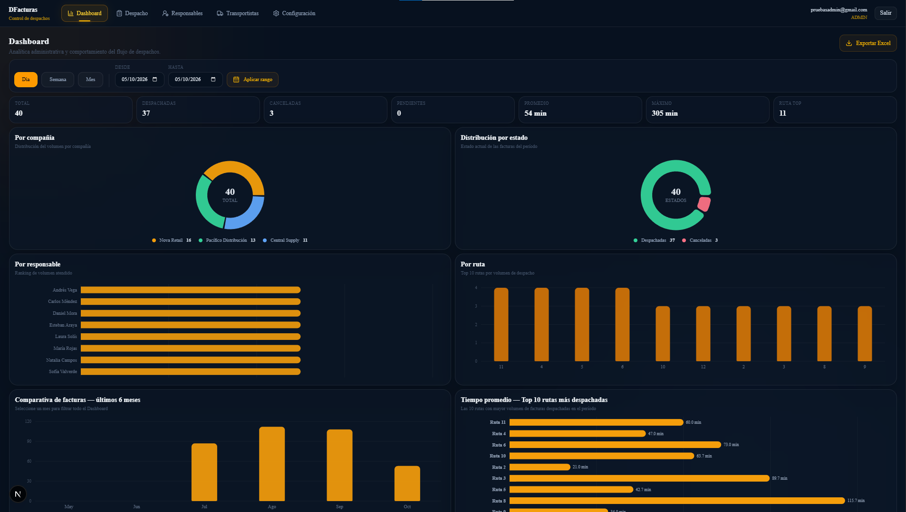
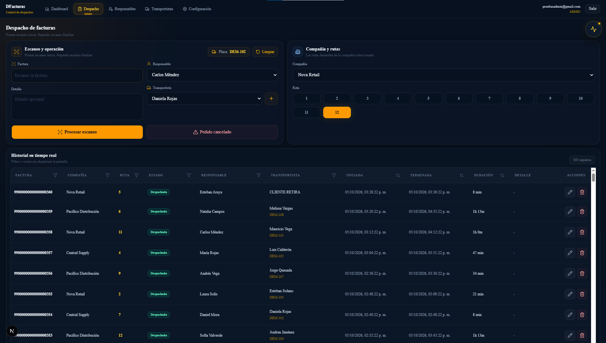
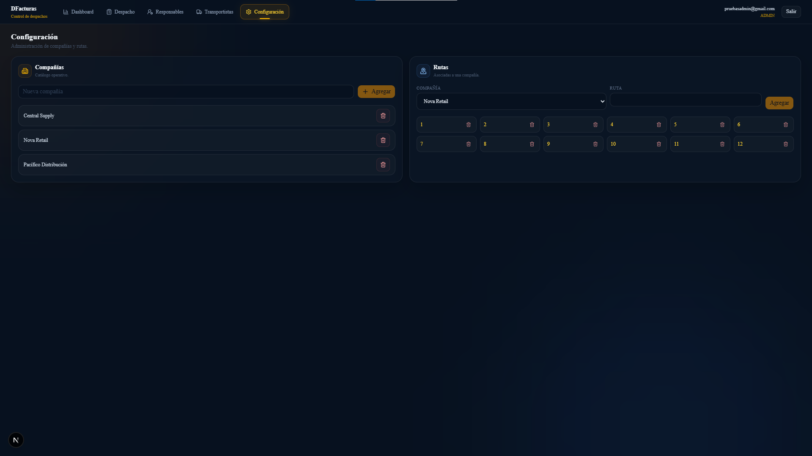

# DFacturas
<!-- portfolio-badges-start -->


<!-- portfolio-badges-end -->

A role-aware logistics dispatch application built with **Next.js, TypeScript, Supabase and PostgreSQL**. DFacturas models a real operational workflow in which an invoice is scanned once to begin dispatch handling and scanned again to complete it, while administrative users manage catalogs, analytics and audit history.

The project is designed as a portfolio-grade application with an emphasis on **domain rules, authorization at the data layer, traceability, transactional RPCs and maintainable separation of concerns**.

<!-- access-callout-start -->

> **Access model:** DFacturas includes email/password login but intentionally has no public sign-up. It is designed as an internal logistics application. To run your own instance, create the user manually in **Supabase Dashboard > Authentication > Users**, then activate the associated profile and assign its role.

<!-- access-callout-end -->

## Product preview

<!-- product-preview-start -->

### Operational analytics

The administrative dashboard provides operational KPIs, date-range analysis, dispatch distribution, route performance and responsible-person rankings.



### Dispatch workflow

The central operational module handles invoice scanning, responsible/carrier assignment, company and route context, dispatch state transitions and real-time history.



### Administration

Administrative users manage companies and their associated routes through a focused configuration interface.



<!-- product-preview-end -->
## Highlights

- 20-digit invoice scanning workflow: first scan starts a dispatch, second scan finalizes it.
- Dispatch states: `ATENDIENDO`, `DESPACHADA`, `PEDIDO_CANCELADO`.
- Role model with `ADMIN` and `OPERATIVO` profiles.
- Server-side route guards plus PostgreSQL Row Level Security (RLS).
- Critical mutations executed through PostgreSQL RPCs instead of unrestricted table writes.
- Soft-delete semantics for operational history.
- Audit log for sensitive table changes.
- Admin dashboard with date ranges, cross-filters, operational KPIs, charts and Excel export.
- Catalog management for responsables, carriers, vehicles, companies and routes.
- Special `CLIENTE RETIRA` workflow enforced as a domain invariant rather than by display text alone.
- Safe application error mapping that avoids exposing raw PostgreSQL/Supabase errors to users.
- Unit tests for auth and dispatch domain rules, plus a SQL hardening verifier.

## Tech stack

| Layer | Technology |
| --- | --- |
| Framework | Next.js 16.3.8 (App Router) |
| UI | React 19.2.8, Tailwind CSS 4, Base UI, Lucide, Recharts |
| Language | TypeScript 5.9 |
| Validation | Zod 4 |
| Auth / Data | Supabase Auth + PostgreSQL |
| Database security | RLS, grants, security-definer RPCs, constraints, triggers |
| Testing | Vitest 5 |
| Deployment target | Vercel + Supabase |

## Functional modules

The main navigation exposes five operational modules:

1. **Dashboard** — admin analytics, KPIs, charts, filters and Excel export.
2. **Despacho** — invoice scan workflow, history, cancellation and correction flows.
3. **Responsables** — operational personnel catalog; all active users can read it, while mutations remain admin-protected at the database layer.
4. **Transportistas** — carrier and vehicle catalog with controlled RPC-based mutations.
5. **Configuración** — admin-only company and route administration.

An internal `/admin/auditoria` route is also available to `ADMIN` users for audit inspection; it is intentionally not a sixth top-level navigation module.

## Architecture

DFacturas uses a layered, feature-oriented structure:

```text
Next.js routes / layouts
        ↓
Feature components
        ↓
Services / use-case orchestration
        ↓
Pure domain rules + Zod boundaries
        ↓
Repositories
        ↓
Supabase client
        ↓
PostgreSQL (RLS + RPC + constraints + triggers)
```

The important rule is that **UI visibility is not authorization**. Components may hide or disable actions according to role, but PostgreSQL remains the security boundary for protected data and critical writes.

See [Architecture](docs/architecture.md) for the design rationale and concrete code examples.

## Engineering principles in the codebase

The project does not treat architectural labels as decoration. The repository demonstrates them through concrete boundaries:

- **Single Responsibility / SOLID-oriented design:** domain rules, service orchestration, repositories, validation and UI are kept in distinct modules.
- **DRY:** shared authorization helpers, error translation, constants, repository mappings and reusable UI primitives avoid duplicated business behavior.
- **Separation of Concerns:** React components do not own PostgreSQL authorization rules; repositories do not render UI; domain functions do not depend on React or Supabase.
- **Single Source of Truth:** database constraints and RPCs enforce critical dispatch invariants even when a client is bypassed.
- **Atomic Design-inspired composition:** reusable low-level UI primitives live in `src/components/ui`, application-level composites in `src/components/app`, and domain-specific compositions inside `src/features/*/components`.
- **Least privilege:** anonymous access is revoked, direct writes are limited, privileged RPCs validate role/state, and internal validators are not executable by authenticated clients.

## Project structure

```text
src/
├─ app/                 Next.js routes, layouts and server boundaries
├─ components/
│  ├─ ui/               reusable UI primitives
│  └─ app/              reusable application shell/navigation/dialogs
├─ constants/           shared constants
├─ domain/              pure domain rules and unit tests
├─ features/            feature-specific UI and domain code
├─ lib/                 Supabase clients, errors and utilities
├─ repositories/        data access and RPC adapters
├─ schemas/             Zod input validation
├─ services/            use-case orchestration and access guards
└─ types/               shared TypeScript contracts

supabase/
├─ migrations/          immutable forward-only schema history
├─ tests/               read-only database hardening verification
└─ seed/                intentionally contains no production data
```

## Database model

Primary tables:

- `profiles`
- `responsables`
- `companias`
- `rutas`
- `transportistas`
- `vehiculos`
- `despachos`
- `audit_logs`

Important database invariants include invoice format, active-invoice uniqueness, route/company consistency, vehicle/carrier consistency, state/timestamp consistency, cancellation reason requirements and soft-delete metadata requirements.

See [Database](docs/database.md) for the relational model and migration strategy.

## Security model

DFacturas uses defense in depth:

- Supabase Auth for authentication.
- `profiles.role` and `profiles.active` for application authorization context.
- RLS on all application tables.
- Explicit grants/revokes for table and function privileges.
- Critical dispatch mutations through RPCs.
- `SECURITY DEFINER` functions with hardened `search_path` where privileged execution is required.
- New auth profiles default to `OPERATIVO` **and inactive** as a defense-in-depth safeguard.
- Public signup and anonymous sign-in are expected to be disabled in the deployed Supabase Auth configuration.
- Soft-deleted dispatch rows are hidden from non-admin operational users.
- Sensitive mutation history is recorded in `audit_logs`.
- Browser code never requires a `service_role` or `sb_secret_*` key.

See [Security](docs/security.md) for controls, threat boundaries and deployment settings.

## Authentication and user provisioning

## Authentication and user provisioning

<!-- user-provisioning-start -->

DFacturas includes a complete email/password authentication flow, but intentionally does **not** expose self-service registration.

This is a security decision, not a missing feature. DFacturas models an internal logistics system in which the organization controls who can access the application.

### Access model

Authentication and authorization are separate concerns:

```text
Supabase Auth
    |
    v
Authenticated identity
    |
    v
public.profiles
    |
    +-- active = false -> access denied
    |
    +-- active = true
            |
            +-- OPERATIVO
            |
            +-- ADMIN
```

- **Supabase Auth** verifies the user's email/password identity.
- `public.profiles` determines whether that authenticated identity can use DFacturas.
- New profiles are created with the `OPERATIVO` role.
- New profiles remain inactive until explicitly enabled.
- `ADMIN` privileges must be granted intentionally.
- Public sign-up and anonymous authentication remain disabled.

Creating an Auth user therefore does **not** automatically grant application access.

### Create the first user

After creating your own Supabase project and applying the database migrations:

1. Open **Supabase Dashboard > Authentication > Users**.
2. Select **Add user**.
3. Create the account with an email address and password.
4. The database trigger creates the associated row in `public.profiles`.
5. Open **SQL Editor**.
6. Activate the profile and assign the required role.
7. Start DFacturas and sign in through `/login`.

Verify the Auth user and application profile:

```sql
select
  u.id,
  u.email,
  p.role,
  p.active
from auth.users u
join public.profiles p
  on p.id = u.id
order by u.created_at desc;
```

Enable an operational user:

```sql
update public.profiles p
set
  role = 'OPERATIVO'::public.app_role,
  active = true,
  updated_at = now()
from auth.users u
where u.id = p.id
  and u.email = 'operator@example.com';
```

Enable an administrator:

```sql
update public.profiles p
set
  role = 'ADMIN'::public.app_role,
  active = true,
  updated_at = now()
from auth.users u
where u.id = p.id
  and u.email = 'admin@example.com';
```

Replace the example email with the user created in your own Supabase project.

### Roles

| Role | Access |
| --- | --- |
| `OPERATIVO` | Authorized dispatch operations |
| `ADMIN` | Operations plus dashboard, catalogs, configuration, audit and administrative functions |

### Credential policy

The public repository intentionally contains no user passwords, shared demo credentials, Supabase `service_role` keys, database passwords, JWT signing secrets or other privileged credentials.

Anyone evaluating the project can create an isolated Supabase instance, apply the migrations and provision their own users using the procedure above.

> Do not enable public sign-up just to create the first account. Use **Authentication > Users > Add user** in Supabase instead.

<!-- user-provisioning-end -->

## Local setup

### Requirements

- Node.js `22.23.3` (see `.nvmrc`)
- npm 10+
- A Supabase project

Clone the repository and install dependencies:

```bash
npm ci
```

Copy the public environment template:

```bash
cp .env.example .env.local
```

On PowerShell:

```powershell
Copy-Item .env.example .env.local
```

Configure only your own public Supabase project values:

```env
NEXT_PUBLIC_SUPABASE_URL=https://your-project-ref.supabase.co
NEXT_PUBLIC_SUPABASE_PUBLISHABLE_KEY=your_supabase_publishable_key
```

Never place `service_role`, `sb_secret_*`, database passwords, JWT signing secrets or private credentials in `NEXT_PUBLIC_*` variables.

### Database

Apply migrations in order from `supabase/migrations/`. Migrations `001` through `005` are forward-only project history and should not be edited after application.

With an authenticated Supabase CLI environment you can first inspect the planned changes:

```powershell
npx --no-install supabase db push --dry-run
```

Then apply them only after confirming that the expected migration set is correct:

```powershell
npx --no-install supabase db push
```

Alternatively, apply the SQL through the Supabase SQL Editor in exact migration order.

### Auth configuration

For the intended closed-demo deployment:

- Email/password authentication: enabled.
- Public signups: disabled.
- Anonymous sign-ins: disabled.
- Manual identity linking: disabled unless explicitly required.
- Rate limits: enabled.
- CAPTCHA: optional; only enable after integrating it into the login flow.
- Site URL: set to the final deployed URL.
- Redirect URLs: keep the allow-list minimal.

### Run

```bash
npm run dev
```

Open `http://localhost:3000`.

## Quality gates

```bash
npm test
npx tsc --noEmit
npm run lint
npm audit --omit=dev
npm run build
```

The validated pre-publication snapshot passed:

- **13/13 domain tests**
- TypeScript check
- ESLint
- production dependency audit with **0 reported vulnerabilities**
- Next.js production build using Webpack
- pre-GitHub secret / sensitive-file gate

A read-only database hardening verifier is included at:

```text
supabase/tests/20261004000005_security_hardening_verify.sql
```

See [Testing](docs/testing.md) for exactly what is and is not covered.

## Deployment

The intended production topology is:

```text
Browser
   │
   ▼
Vercel / Next.js
   │
   ▼
Supabase Auth + Data API
   │
   ▼
PostgreSQL
(RLS + RPC + constraints + audit)
```

See [Deployment](docs/deployment.md) for a release checklist.

## Demo-data policy

This repository must not contain production customer, employee, order, invoice or credential data. Use only fictional records in screenshots, local demos and test fixtures. The committed `supabase/seed` directory intentionally does not include production data.

## Documentation

- [Architecture](docs/architecture.md)
- [Database](docs/database.md)
- [Security](docs/security.md)
- [Testing](docs/testing.md)
- [Deployment](docs/deployment.md)
- [Versión en español](README.es.md)

## Scope notes

DFacturas is a portfolio implementation focused on dispatch operations, authorization, auditability and maintainable application structure. It is not presented as a generic ERP, accounting engine or invoicing tax platform.
