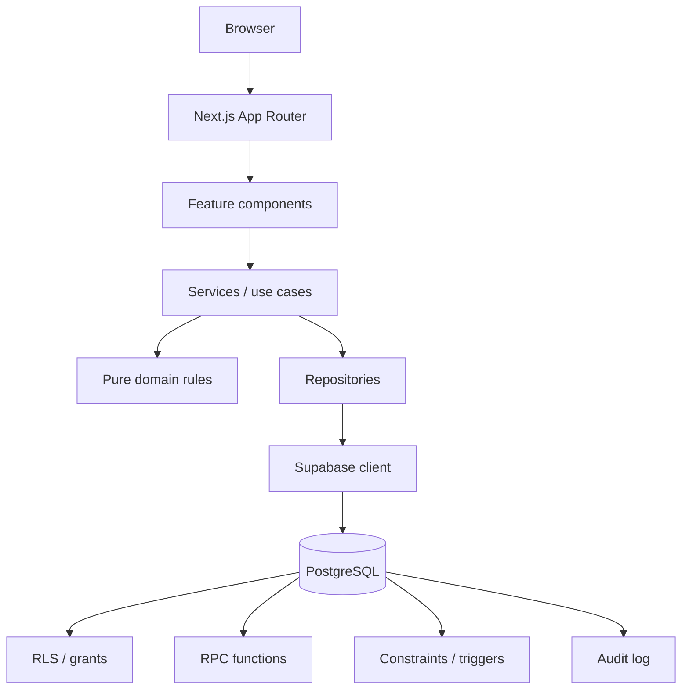
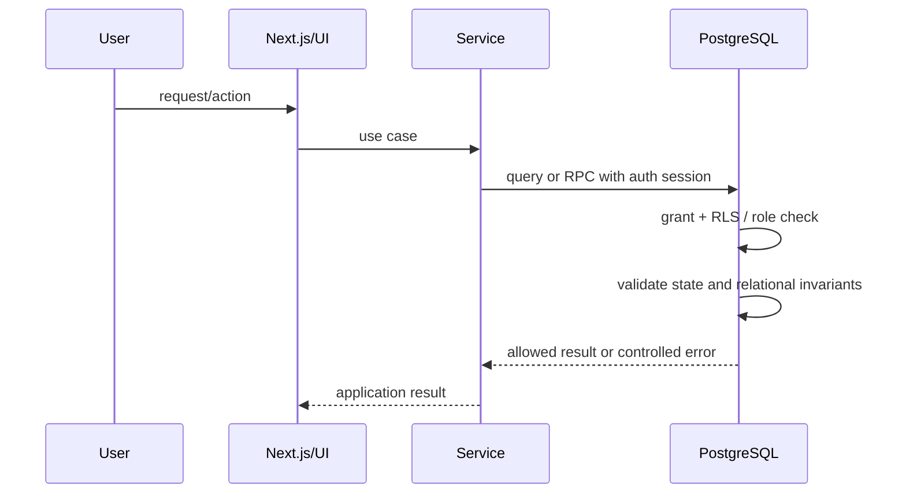

# Architecture

## Purpose

DFacturas is organized to keep operational UI, business rules, data access and authorization concerns separate. The design is deliberately pragmatic: the project uses clear boundaries where they improve correctness and maintainability, without adding abstract layers that have no concrete responsibility.

## Runtime flow



Not every request traverses every box. For example, a route guard can call an auth repository directly through `auth.service.ts`, while a UI component can read catalog data through a catalog service/repository. The important invariant is that protected operations still end at a database boundary that enforces authorization.

## Layer responsibilities

### `src/app`

Next.js routes, layouts and server-side access boundaries.

Examples:

- `src/app/page.tsx` redirects authenticated users to `/app` and unauthenticated users to `/login`.
- `src/app/app/page.tsx` requires an active profile before rendering the dispatch workspace.
- `src/app/admin/dashboard/page.tsx` requires `ADMIN`.
- `src/app/admin/auditoria/page.tsx` requires `ADMIN`.

### `src/features`

Feature-specific presentation and, when useful, feature-local domain logic.

Examples:

- `features/despachos/components/*` — scan workspace, KPIs, table and dialogs.
- `features/dashboard/components/*` — analytics visualization and Excel export.
- `features/configuracion/components/*` — company/route administration.
- `features/despachos/domain/dispatch.rules.ts` — scan-decision mapping used by the feature.

### `src/domain`

Pure rules that do not require React, Next.js or Supabase.

Examples:

- `domain/auth/auth.rules.ts`
- `domain/dispatch/invoice.rules.ts`
- `domain/dispatch/scan.rules.ts`

Because these rules are infrastructure-independent, they are inexpensive to unit test.

### `src/services`

Use-case orchestration and application-level access guards.

Examples:

- `requireUser`, `requireProfile`, `requireAdmin` in `auth.service.ts`.
- `processFacturaScan` in `scan.service.ts`.
- catalog/admin services re-export or orchestrate repository operations without putting SQL/Data API details in components.

### `src/repositories`

Supabase Data API and RPC adapters. Repositories translate persistence shapes into application shapes and centralize data-access errors.

Examples:

- `dispatch.repository.ts` reads dispatch history and invokes protected dispatch RPCs.
- `catalog.repository.ts` maps database rows into catalog types.
- `admin.repository.ts` uses compatibility/admin RPCs for controlled mutations.

### `src/schemas`

Zod schemas validate untrusted application input before orchestration reaches repositories. Database constraints/RPC validation still repeat security-critical invariants because browser validation is not a trust boundary.

### `src/lib`

Cross-cutting infrastructure:

- browser/server Supabase client construction;
- safe error translation;
- shared utilities/date formatting.

## Authorization path



UI role checks are convenience controls. Database policies/functions are the authorization boundary.

## SOLID-oriented design

DFacturas does not claim that every SOLID pattern requires an interface or class. It applies the principles where they have concrete value.

### Single Responsibility Principle

Examples:

- `invoice.rules.ts` only normalizes/validates invoice identifiers.
- `safe-error.ts` only maps infrastructure errors into safe user-facing messages.
- repositories own data-access concerns.
- services own use-case orchestration.

### Open/Closed and composition

Shared application behavior is extended through composition: reusable UI primitives, app-shell components and feature-specific components can be composed without duplicating base behavior.

### Interface segregation / dependency direction

Components consume narrow service/repository functions instead of a global “database service”. Domain rules accept plain values/types and do not import Supabase.

### Dependency inversion — pragmatic scope

The domain layer depends on domain types, not Supabase. The current repository layer is implemented directly against Supabase rather than hidden behind abstract runtime interfaces; this is intentional to avoid unnecessary indirection in the current project size.

## DRY

Concrete shared sources include:

- auth guards in `auth.service.ts`;
- user-safe infrastructure error mapping in `safe-error.ts`;
- reusable catalog mapping in repositories;
- navigation configuration in `app-shell.tsx`;
- shared visual primitives in `src/components/ui`;
- database helper functions such as `is_admin()`, `is_active_user()` and `require_active_user()`.

DRY is not used to force unrelated workflows into one generic abstraction.

## Atomic Design-inspired component composition

The repository uses Atomic Design as a pragmatic composition heuristic rather than a strict directory taxonomy:

```text
src/components/ui/       low-level reusable UI primitives
src/components/app/      application-level reusable composites
src/features/*/components domain/feature compositions
src/app/                 route-level page composition
```

This reflects the progression from reusable primitives to feature and page compositions without requiring literal `atoms/`, `molecules/`, `organisms/` directories.

## Single Source of Truth

Critical operational truth lives as close to the data as possible:

- invoice format and uniqueness: PostgreSQL constraints/indexes;
- dispatch state transitions: RPC functions and state constraints;
- carrier/vehicle and route/company relationships: foreign keys/validators;
- role authorization: `profiles` + authorization helpers/RLS;
- soft-delete visibility: RLS and explicit query filters;
- application constants/types: centralized TypeScript modules.

The browser may mirror rules for user experience, but cannot weaken the database invariants.

## Concurrency

`scan_dispatch` uses transaction-level locking around the invoice identifier before making a transition. This protects the “first scan / second scan” state machine against concurrent requests that could otherwise observe the same stale state.

## Error boundary strategy

Database errors are not displayed directly. Known domain/database errors are mapped to user-safe Spanish messages in `src/lib/errors/safe-error.ts`. Unknown errors fall back to generic application messages.

## Navigation / access matrix

| Area | OPERATIVO | ADMIN | Enforcement |
| --- | --- | --- | --- |
| Login / logout | Yes | Yes | Supabase Auth |
| Dispatch workspace | Yes | Yes | active-profile guard + DB controls |
| Responsables read | Yes | Yes | RLS |
| Responsables mutation | No | Yes | DB policy/RPC + UI controls |
| Transportistas read | Yes | Yes | RLS |
| Protected carrier/vehicle mutation | constrained | Yes/admin operations | RPC/grants + domain checks |
| Dashboard | No | Yes | `requireAdmin` + admin RPC |
| Configuration | No | Yes | `requireAdmin` + DB authorization |
| Audit log | No | Yes | `requireAdmin` + RLS |

The exact mutation permission depends on the operation/RPC; the table intentionally avoids describing UI-only restrictions as security controls.
