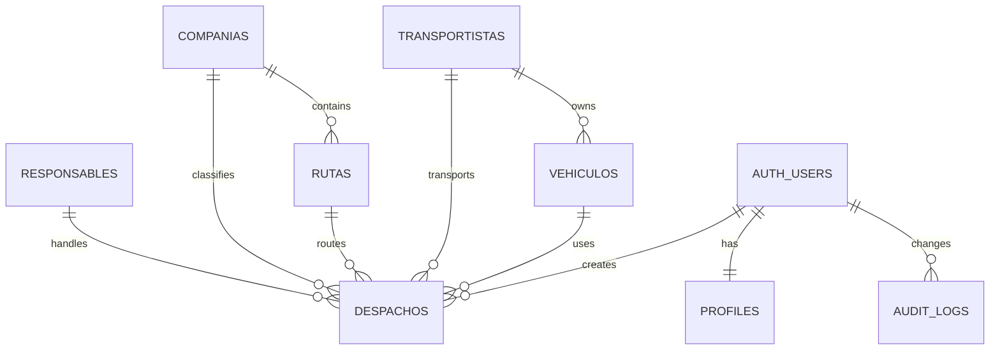
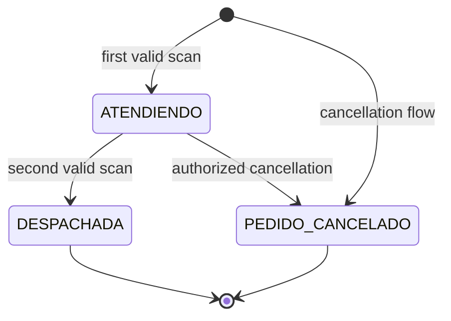

# Database

## Overview

DFacturas uses PostgreSQL through Supabase. The database is not a passive storage layer: it enforces dispatch state, relational integrity, authorization and auditability.

## Core entities

### Tables

| Table | Purpose |
| --- | --- |
| `profiles` | application role and active state for an Auth user |
| `responsables` | personnel responsible for dispatch preparation |
| `companias` | company/client catalog |
| `rutas` | routes associated with a company |
| `transportistas` | carrier catalog, including the special `CLIENTE RETIRA` flag |
| `vehiculos` | vehicles/plates associated with a carrier |
| `despachos` | operational invoice dispatch state and timestamps |
| `audit_logs` | immutable-style record of sensitive row changes from database triggers |

## Enums

### `app_role`

- `ADMIN`
- `OPERATIVO`

### `dispatch_status`

- `ATENDIENDO`
- `DESPACHADA`
- `PEDIDO_CANCELADO`

## Dispatch invariants

The baseline schema and later hardening migrations enforce rules such as:

- `factura` must match exactly 20 numeric digits.
- only one non-soft-deleted dispatch may exist for an invoice.
- a route cannot exist on a dispatch without a company.
- `(ruta_id, compania_id)` must be a valid route/company pair.
- a vehicle cannot exist on a dispatch without a carrier.
- `(vehiculo_id, transportista_id)` must be a valid vehicle/carrier pair.
- `ATENDIENDO` requires a start timestamp and no final/cancel timestamp.
- `DESPACHADA` requires start + final timestamps and no cancel timestamp.
- `PEDIDO_CANCELADO` requires a cancel timestamp and a non-empty reason.
- soft delete requires `deleted_at`, `deleted_by` and a non-empty `delete_reason` together.
- dispatch detail/delete-reason fields are capped at 1000 characters after security hardening.

## State machine

A terminal state cannot be silently converted by a normal scan. Corrections/deletions use explicit privileged RPCs with validation.

## Special carrier: `CLIENTE RETIRA`

`transportistas.es_cliente_retira` is a boolean domain flag. A partial unique index ensures only one carrier can hold the special flag. Database validation prevents a `CLIENTE RETIRA` dispatch from being associated with a vehicle.

This avoids coupling a business invariant to a UI label string.

## Migration history

The repository currently contains five applied forward-only migrations:

| Version | Purpose |
| --- | --- |
| `20260930000001_initial_schema.sql` | relational baseline, enums, constraints, indexes and validation triggers |
| `20260930000002_security_audit.sql` | profiles, auth helpers, RLS, grants and audit logging |
| `20260930000003_dispatch_rpcs.sql` | transactional dispatch RPCs |
| `20261002000004_original_ui_compatibility.sql` | compatibility/admin RPCs and dashboard analytics/export functions |
| `20261004000005_security_hardening.sql` | least-privilege hardening, inactive-by-default users, soft-delete visibility, text limits and stricter RPC validation |

### Rule: migrations are immutable after application

Do not edit, reorder, reset or “repair” migrations `001`–`005` after they have been applied to an environment. Future schema changes should use a new migration with a later version.

## Authorization helpers

The database defines helpers including:

- `current_user_role()`
- `is_admin()`
- `is_operativo()`
- `is_active_user()`
- `require_active_user()`

These centralize role/active-profile checks used by RLS policies and RPCs.

## Dispatch RPCs

Security-sensitive operations include:

- `scan_dispatch(...)`
- `cancel_dispatch(...)`
- `admin_update_dispatch(...)`
- `admin_soft_delete_dispatch(...)`

Compatibility/admin functions support UI parity while preserving database authorization, such as carrier/vehicle operations, route management and dashboard data retrieval.

## Concurrency control

`scan_dispatch` serializes concurrent work for a specific invoice before evaluating the current row/state. The goal is to prevent simultaneous scans from both making decisions against the same stale dispatch state.

## RLS and direct privileges

All application tables have RLS enabled. Table grants and function execution privileges are separately constrained. In particular, migration `005` removes direct authenticated insert/update privileges for `transportistas` and `vehiculos`, forcing those mutation paths through validated RPCs.

Soft-deleted dispatch rows are not visible to ordinary active operational users; admins retain access for administrative/audit purposes.

## Audit trail

Database triggers write sensitive row changes to `audit_logs` with:

- table name;
- record ID;
- action (`INSERT`, `UPDATE`, `DELETE`);
- old/new JSON snapshots when applicable;
- authenticated user ID when available;
- timestamp.

`audit_logs` is readable only by `ADMIN` through RLS and is not directly writable by browser clients.

## Seed/data policy

No real production data belongs in the repository. The committed seed directory is intentionally empty apart from repository placeholders. Demo environments should use fictional records only.
