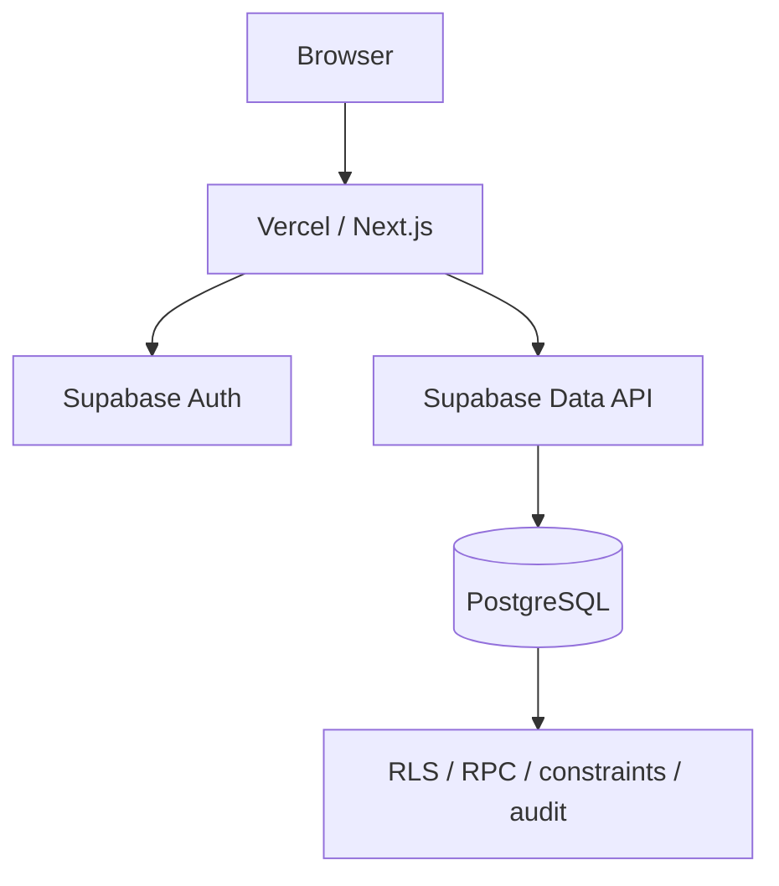

# Deployment

## Target topology

DFacturas is designed for a Vercel + Supabase deployment.



## 1. Pre-deployment quality gate

From a clean working tree/environment:

```bash
npm ci
npm test
npx tsc --noEmit
npm run lint
npm audit --omit=dev
npm run build
git diff --check
```

Do not deploy if secrets, `.env.local`, local backups or production data are staged/tracked.

## 2. Supabase project

Use a dedicated Supabase project for the deployment. Never reuse a production database containing unrelated real operational data for a public portfolio demo.

Required client environment values:

```env
NEXT_PUBLIC_SUPABASE_URL=https://your-project-ref.supabase.co
NEXT_PUBLIC_SUPABASE_PUBLISHABLE_KEY=your_supabase_publishable_key
```

The application does not require a browser-exposed `service_role` key.

## 3. Apply database migrations

Apply `supabase/migrations/*` in exact order.

When using the CLI in an environment where the project is already linked/authenticated:

```powershell
npx --no-install supabase migration list
npx --no-install supabase db push --dry-run
npx --no-install supabase db push
```

Confirm the dry run contains only the migration(s) you expect before pushing.

### Forward-only rule

Do not edit/reset/repair applied migrations `001`–`005`. Create a new later migration for future changes.

## 4. Verify database hardening

Run in Supabase SQL Editor after migration `005`:

```text
supabase/tests/20261004000005_security_hardening_verify.sql
```

The script must finish without a `VERIFY_FAILED` exception.

## 5. Configure Supabase Auth

For the closed portfolio demo:

### Sign In / Providers

- Email: enabled.
- Allow new users to sign up: **OFF**.
- Allow manual linking: **OFF**, unless the application later requires identity linking.
- Allow anonymous sign-ins: **OFF**.

### Rate Limits

Keep rate limiting enabled. Default project limits are suitable for normal demo traffic unless evidence shows a need to tune them.

### Attack Protection

- Leaked-password protection: enable when available.
- CAPTCHA: leave disabled until the login UI is explicitly integrated with the selected CAPTCHA provider; enabling it only in Supabase can break login.

### URL Configuration

Before public deployment:

- replace `http://localhost:3000` Site URL with the final HTTPS URL;
- add only required redirect URLs;
- avoid broad wildcard redirect rules unless there is a documented need.

## 6. Create demo users

Use fictional demo identities. Do not document real personal email accounts or passwords in the repository.

Recommended setup:

- one active `ADMIN` user;
- one active `OPERATIVO` user;
- optionally one inactive user for access-control testing.

Because new profiles default to inactive, explicitly activate only the intended demo users and assign `ADMIN` only through an administrative database/dashboard process you control.

Never commit demo passwords.

## 7. Vercel

Create/import the GitHub repository in Vercel.

Set environment variables in Vercel project settings:

```text
NEXT_PUBLIC_SUPABASE_URL
NEXT_PUBLIC_SUPABASE_PUBLISHABLE_KEY
```

Do not add a service-role key unless a future server-only feature genuinely requires it; if that ever becomes necessary, it must remain server-only and must never use a `NEXT_PUBLIC_` prefix.

The repository build command is:

```text
npm run build
```

which executes `next build --webpack`.

## 8. Post-deployment smoke test

Test with both roles:

### ADMIN

- login/logout;
- dashboard loads and filters;
- dispatch workflow;
- responsables mutation;
- transportistas/plates mutation;
- company/route configuration;
- audit route access.

### OPERATIVO

- login/logout;
- dispatch workflow;
- allowed catalog reads/actions;
- dashboard/configuration/audit remain inaccessible according to authorization rules.

### Security behavior

- inactive account cannot enter the application;
- invalid dispatch relationships are rejected;
- soft-deleted dispatches are not exposed to OPERATIVO;
- anonymous requests cannot execute protected RPCs;
- no raw SQL/Supabase error details appear in the UI.

## 9. Public-repository checklist

Before the first public push:

- `.env.example` contains placeholders only;
- `.env.local` is ignored and untracked;
- no `service_role`, `sb_secret_*`, JWTs, DB passwords or private keys exist in tracked files/history;
- `backups/`, `.next/`, `node_modules/`, `.vercel/` and `supabase/.temp/` are ignored;
- screenshots/fixtures contain only fictional data;
- Git history has been reviewed for sensitive files if the repo existed before sanitization;
- README/docs describe the current implementation, not planned features as if they already existed.

## 10. Rollback principle

Application deployments can be rolled back at the hosting layer, but applied database migrations remain forward-only. If a database change requires correction, ship a new corrective migration rather than rewriting an already-applied migration.
