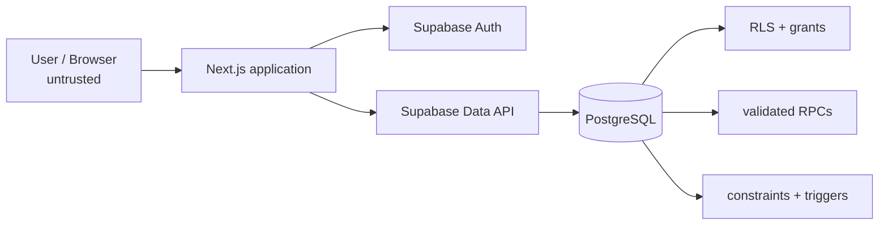

# Security

## Security objective

DFacturas assumes that browser code is untrusted. Authentication state, hidden buttons and client-side validation improve UX, but they are not sufficient authorization controls. The database remains the security boundary for protected data and critical mutations.

## Trust boundaries



## Authentication

Supabase Auth provides email/password authentication. Application routes load the current Auth user and corresponding `profiles` row.

`requireProfile()` rejects missing or inactive profiles. `requireAdmin()` rejects non-admin profiles for admin-only server routes.

### Intended cloud settings for the closed demo

The deployed Supabase project is expected to use:

- Email auth: enabled.
- Public signup: disabled.
- Anonymous sign-in: disabled.
- Manual identity linking: disabled unless explicitly required.
- Rate limits: enabled.
- Leaked-password protection: enabled when available for the project plan/configuration.
- CAPTCHA: optional; do not enable until the login flow sends the required CAPTCHA token.
- Site URL: the exact deployed application URL.
- Redirect allow-list: minimal, with no unnecessary broad wildcards.

Cloud dashboard settings are deployment configuration and are not fully represented by SQL migrations; they must be reviewed per environment.

## Profile creation and privilege escalation

`handle_new_user()` creates a profile with:

- role: `OPERATIVO`;
- active: `false`.

It intentionally does not accept a role from client-controlled user metadata. This is defense in depth: even if public signup were accidentally re-enabled, a new Auth identity would not immediately become an active operational user.

Admin elevation/activation must be an explicit administrative action outside client-controlled signup metadata.

## RLS

RLS is enabled on:

- `profiles`
- `responsables`
- `companias`
- `rutas`
- `transportistas`
- `vehiculos`
- `despachos`
- `audit_logs`

Policies use authenticated identity and database authorization helpers rather than trusting request payload role claims.

## Least privilege

Migration `005` strengthens privilege boundaries by:

- revoking `CREATE` on the `public` schema from public/anonymous/authenticated roles;
- revoking default public function execution;
- revoking anonymous execution for application RPCs;
- granting only the specific RPC execution needed by authenticated sessions;
- making the internal `validate_dispatch_context(...)` helper non-executable by authenticated clients;
- removing direct authenticated insert/update privileges on `transportistas` and `vehiculos`.

## Critical mutation boundary

Direct browser writes are not used for the dispatch state machine. Critical operations go through functions such as:

```text
scan_dispatch
cancel_dispatch
admin_update_dispatch
admin_soft_delete_dispatch
```

These functions validate authentication/role, current state and relational context before applying the mutation.

## RPC search path

Privileged security-definer functions in the hardening layer set a restricted search path (`pg_catalog, public`) to reduce object-resolution ambiguity inside privileged execution.

## Soft-delete visibility

`despachos_select` allows:

- admins to inspect rows required for administrative/history use;
- active non-admin users to read only rows where `deleted_at IS NULL`.

Application repository queries also filter soft-deleted rows during normal operational listing. The RLS policy is the security control; the repository filter is an additional behavior-level safeguard.

## Input validation

Defense is layered:

1. React/form UX constraints where applicable.
2. Zod schemas at application boundaries.
3. RPC validation for stateful/privileged operations.
4. PostgreSQL constraints, foreign keys and triggers for final integrity.

Examples include UUID validation, 20-digit invoices, 1000-character detail limits, valid route/company pairs and valid carrier/vehicle pairs.

## Error handling

`src/lib/errors/safe-error.ts` maps known database/domain failures to controlled user-facing messages. Unknown internal errors fall back to generic messages instead of displaying raw database details.

The login page uses an allow-listed error-code-to-message map rather than echoing arbitrary `?error=` text.

## Audit logging

Database triggers record sensitive row changes in `audit_logs`. The browser has no direct write path to the audit table, and only `ADMIN` can read it through RLS.

## Secrets

### Allowed in browser configuration

Only public project identifiers/keys intended for client use:

```env
NEXT_PUBLIC_SUPABASE_URL=...
NEXT_PUBLIC_SUPABASE_PUBLISHABLE_KEY=...
```

### Never commit or expose in browser code

- Supabase `service_role` keys;
- `sb_secret_*` keys;
- database passwords/connection strings with credentials;
- JWT signing secrets;
- private keys/certificates;
- GitHub tokens;
- `.env.local`.

The public `.env.example` contains placeholders only.

## Repository hygiene

`.gitignore` excludes local/runtime artifacts including:

- `.env*` except `.env.example`;
- `node_modules`;
- `.next`;
- `backups`;
- `supabase/.temp`;
- `.vercel`;
- certificates/private-key extensions;
- `*.bak`, logs and build metadata.

A pre-publication gate additionally scans tracked files and source content for common secret patterns.

## Database hardening verifier

The repository includes:

```text
supabase/tests/20261004000005_security_hardening_verify.sql
```

It is intentionally read-only apart from raising exceptions/notices. It verifies a subset of post-migration security expectations, including:

- `public` schema create privileges revoked from client roles;
- inactive-by-default profile creation;
- direct carrier/vehicle writes removed;
- soft-delete filtering present in the dispatch RLS policy;
- dispatch text-length constraints present;
- anonymous `scan_dispatch` execution revoked;
- authenticated `scan_dispatch` execution present;
- internal context validator not executable by authenticated users.

Passing this verifier does not prove the entire application is free of vulnerabilities; it proves the listed controls are present in that database environment.

## Dependency audit statement

At the validated pre-publication gate, `npm audit --omit=dev` reported **0 production dependency vulnerabilities**. Development-tool advisories, if any appear in future full audits, must be evaluated separately and should not be “fixed” by forcing incompatible dependency downgrades/upgrades without regression testing.

## Threats specifically addressed

- unauthorized role access;
- anonymous Data API access;
- direct mutation bypass of UI controls;
- stale/concurrent dispatch scans;
- invalid catalog relationships;
- exposure of soft-deleted operational rows;
- role escalation through signup metadata;
- raw database error disclosure;
- accidental secret publication;
- unaudited sensitive row changes.

## Out of scope / operational responsibilities

Security still depends on deployment practices outside this repository, including account MFA, Supabase/Vercel account security, secret rotation, HTTPS/TLS, backup policy, platform availability, monitoring and timely dependency updates.
